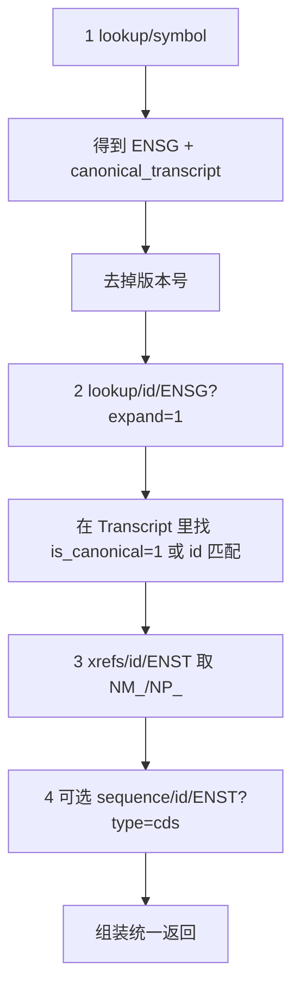

# 基因 / MANE Select 查找规格（供其他工程实现）

把步骤 1（及可选 CDS）的查找流程、公开 REST 参数和返回字段固定下来。实现时按本规格直连 Ensembl / UCSC，不要再对带版本号的 `ENST….5` 做 `lookup/id`。

公共基址：

- Ensembl：`https://rest.ensembl.org`
- UCSC：`https://api.genome.ucsc.edu`

公共 Header（Ensembl JSON）：

```http
Accept: application/json
Content-Type: application/json
```

**ID 规则（必须先做）**：凡传给 `lookup/id` 或 `sequence/id` 的 Ensembl ID，去掉版本号：`ENST00000302118.5` → `ENST00000302118`（正则 `r'\.\d+$'`）。`lookup/symbol` 的 `canonical_transcript` 经常带版本，列表里的 `Transcript[].id` 通常不带。

---

## 推荐固定流程（4 次 HTTP，第 4 次可选）



UCSC search 只作交叉验证，不是主数据源。MANE / RefSeq 以 Ensembl `xrefs` 为准更稳。

---

## 接口 1：按基因符号查基因

`GET /lookup/symbol/{species}/{symbol}`

| 项 | 值 |
|----|----|
| 示例 | `GET https://rest.ensembl.org/lookup/symbol/homo_sapiens/PCSK9` |
| path `species` | 人类用 `homo_sapiens`（不要用 `human`） |
| path `symbol` | 基因符号，如 `PCSK9` |
| query（可选） | `expand=1`：一次带上全部转录本（可与接口 2 合并，省一次请求） |

未带 expand 时的关键返回（Ensembl 原始 JSON 根上）：

| 字段 | PCSK9 实例 | 含义 |
|------|------------|------|
| `id` | `ENSG00000169174` | 基因 ID |
| `display_name` | `PCSK9` | 符号 |
| `description` | `proprotein convertase subtilisin/kexin type 9 [Source:HGNC Symbol;Acc:HGNC:20001]` | 描述 |
| `seq_region_name` | `1` | 染色体（无 `chr` 前缀） |
| `start` / `end` | `55039445` / `55064852` | 基因基因组坐标，**1-based 闭区间** |
| `strand` | `1` | `1` = 正链，`-1` = 负链 |
| `assembly_name` | `GRCh38` | 组装 |
| `biotype` | `protein_coding` | 生物类型 |
| `canonical_transcript` | `ENST00000302118.5` | 经典转录本，**常带版本** |
| `object_type` | `Gene` | 对象类型 |
| `species` | `homo_sapiens` | 物种 |

失败：404 基因不存在；400 物种/符号非法。

---

## 接口 2：按基因 ID 展开全部转录本

`GET /lookup/id/{id}`

| 项 | 值 |
|----|----|
| 示例 | `GET https://rest.ensembl.org/lookup/id/ENSG00000169174?expand=1` |
| path `id` | **无版本** 的 `ENSG…`（也可查无版本 `ENST…`） |
| query `expand` | `1`：返回 `Transcript[]`（及外显子、Translation） |

**不要**调用 `lookup/id/ENST00000302118.5`，会 400：`ID 'ENST00000302118.5' not found`。

基因级关键字段同接口 1。展开后增加 `Transcript[]`，每项：

| 字段 | 经典转录本实例 | 含义 |
|------|----------------|------|
| `id` | `ENST00000302118` | 转录本稳定 ID |
| `Parent` | `ENSG00000169174` | 所属基因 |
| `display_name` | `PCSK9-201` | 转录本名 |
| `biotype` | `protein_coding` | 如 `nonsense_mediated_decay`、`retained_intron` |
| `is_canonical` | `1` | `1` 即为 Ensembl canonical |
| `start` / `end` / `length` | `55039548` / … / `3637` | 转录本基因组跨度、cDNA 长度 |
| `strand` | `1` | 链 |
| `Translation.id` | `ENSP00000303208` | 蛋白 ID |
| `Translation.start` / `end` | `55039838` / `55063584` | **CDS 基因组起止** |
| `Translation.length` | `692` | 氨基酸数（CDS nt ≈ 692×3 + 终止密码子 → 2079） |

选定规则（按优先级）：

1. `Transcript[].is_canonical == 1`
2. 否则 `id == strip_version(gene.canonical_transcript)`
3. 否则取 `biotype == protein_coding` 中最长的，并标记 `selection_method` 非 MANE/canonical

PCSK9：16 条转录本，选中 `ENST00000302118`。

---

## 接口 3：转录本外部交叉引用（RefSeq / MANE）

`GET /xrefs/id/{id}`

| 项 | 值 |
|----|----|
| 示例 | `GET https://rest.ensembl.org/xrefs/id/ENST00000302118` |
| path `id` | **无版本** `ENST…` |

返回 JSON **数组**，每项大致为：

| 字段 | 用途 |
|------|------|
| `dbname` | 库名。MANE/RefSeq 看 `RefSeq_mRNA`、`RefSeq_peptide`，有时有 `RefSeq_mRNA_predicted` |
| `display_id` / `primary_id` | 如 `NM_174936.4`、`NP_777596.2` |
| `info_type` / `info_text` | 部分记录会标 MANE Select |

取 `dbname == "RefSeq_mRNA"` → `NM_…`；`dbname == "RefSeq_peptide"` → `NP_…`。  
这比 UCSC search 解析更稳，对应实例结果 `NM_174936.4` / `NP_777596.2`。

---

## 接口 4（交叉验证，可选）：UCSC 基因组搜索

`GET https://api.genome.ucsc.edu/search`

| query | 值 |
|-------|-----|
| `search` | 基因符号，如 `PCSK9` |
| `genome` | 人类用 `hg38`（对应 GRCh38） |

从返回的匹配列表里找同时含 `ENST00000302118` 与 `NM_174936` 的 MANE / gene 条目。字段结构不如 Ensembl 稳定，**不要当主键**。

注意：UCSC 坐标是 **0-based 半开**；Ensembl 是 **1-based 闭区间**。不要混用后直接比数字。

---

## 接口 5（可选，步骤 2）：取 CDS 序列

`GET /sequence/id/{id}`

| 项 | 值 |
|----|----|
| 示例 | `GET https://rest.ensembl.org/sequence/id/ENST00000302118?type=cds` |
| path `id` | **无版本** `ENST…` |
| query `type` | `cds`（只要编码区）；也可用 `cdna` / `protein` / `genomic` |

JSON 返回：

| 字段 | 含义 |
|------|------|
| `id` | 查询的 ID |
| `seq` | CDS 碱基串（DNA：A/T/G/C） |
| `molecule` | 一般为 `dna` |

PCSK9：`len(seq) == 2079`，以 `ATG` 起、止密码子结束。基因组 CDS 坐标来自接口 2 的 `Translation.start/end`，不是本接口。

`type=cds` + `media=fasta` 会返回文本而非 JSON；实现时用 JSON 更简单。

---

## 建议封装的统一返回

```json
{
  "gene": {
    "symbol": "PCSK9",
    "ensembl_gene_id": "ENSG00000169174",
    "gene_description": "proprotein convertase subtilisin/kexin type 9",
    "chromosome": "1",
    "strand": "+",
    "gene_start": 55039445,
    "gene_end": 55064852,
    "assembly": "GRCh38/hg38"
  },
  "mane_select_transcript": {
    "ensembl_transcript": "ENST00000302118.5",
    "ensembl_transcript_stable": "ENST00000302118",
    "refseq": "NM_174936.4",
    "protein": "NP_777596.2",
    "biotype": "protein_coding",
    "canonical": true
  },
  "cds": {
    "length": 2079,
    "genomic_start": 55039838,
    "genomic_end": 55063584,
    "sequence": "ATGGGC..."
  },
  "all_transcripts": [
    {"id": "ENST00000302118", "biotype": "protein_coding", "canonical": true}
  ]
}
```

映射：`strand: 1 → "+"`，`-1 → "-"`；对外可保留带版本的 `ensembl_transcript`（来自 `canonical_transcript`），内部请求只用 `ensembl_transcript_stable`。

---

## 实现时不要重复的坑

- `lookup/id`、`sequence/id` **禁止**带 `.5`
- 读返回时走 Ensembl 原始 JSON；不要依赖 `{success, query_info, result}` 这类包装层
- `expand=1` 必须是 query，不要写进 path
- 物种路径用 `homo_sapiens`
- NCBI Entrez 不要作为主路径
